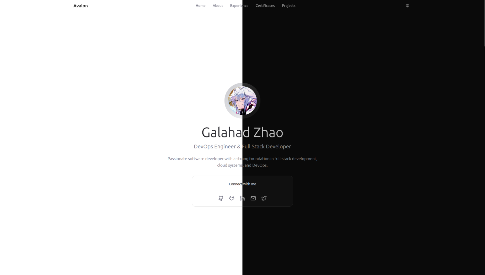
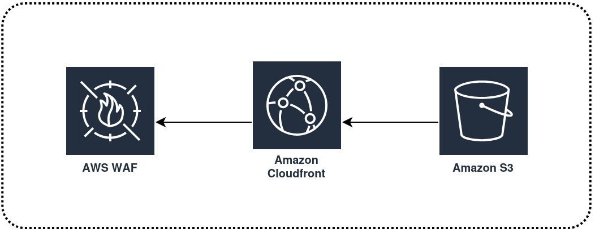

# Avalon

A personal portfolio website that is built with [TypeScript](https://www.typescriptlang.org/), [React](https://react.dev/), and [Tailwind CSS](https://tailwindcss.com/).

  

## Theme Switch

The site page supports light and dark modes.

  

## AWS Deployment

Using WAF + CloudFront + S3 provides a secure, high-performance architecture for static websites.
CloudFront caches content globally for faster delivery, WAF filters malicious traffic and provides DDoS protection, and S3 serves as a private, reliable origin. Together they improve security, speed, scalability, and cost efficiency compared to exposing S3 directly.

  

---

## License

